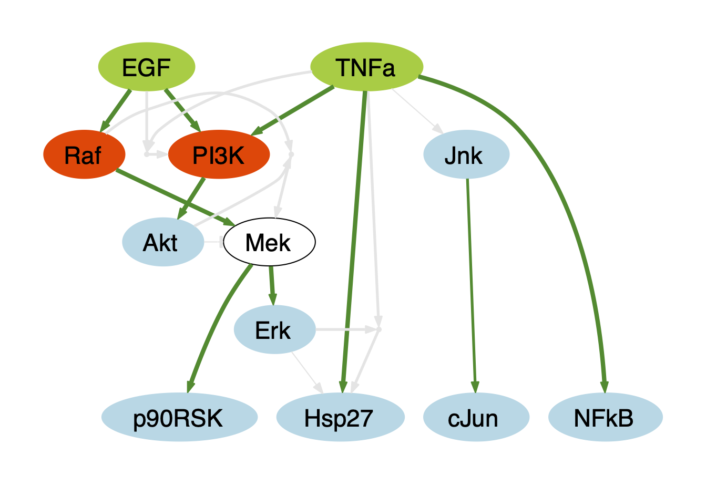
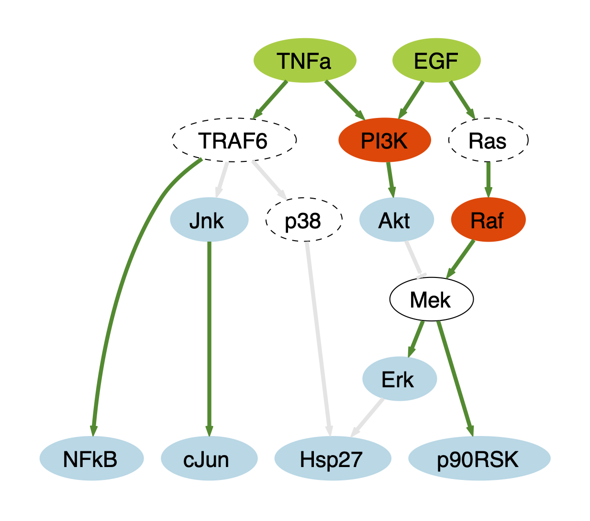
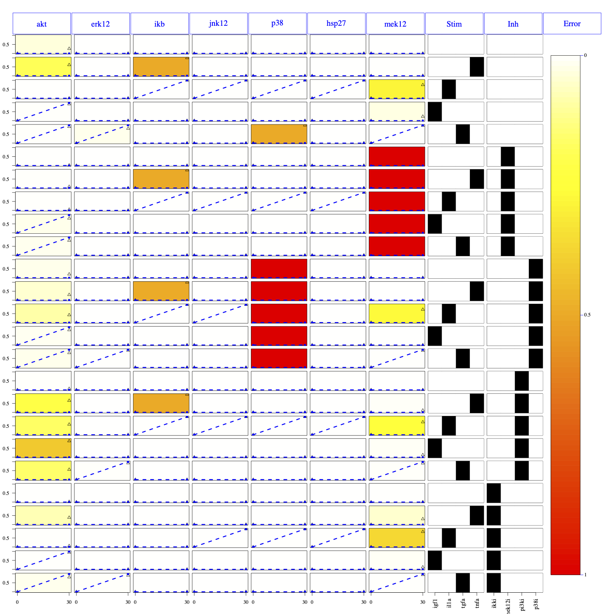
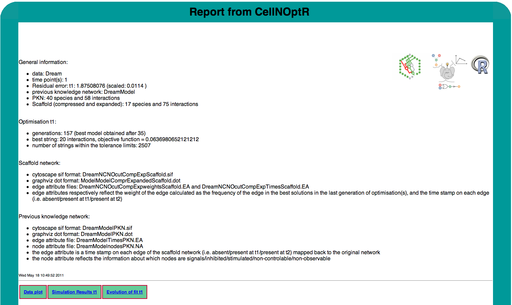
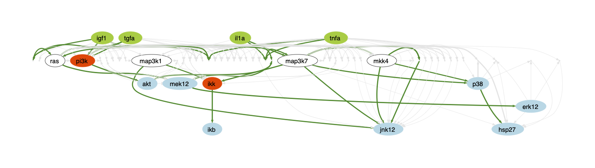
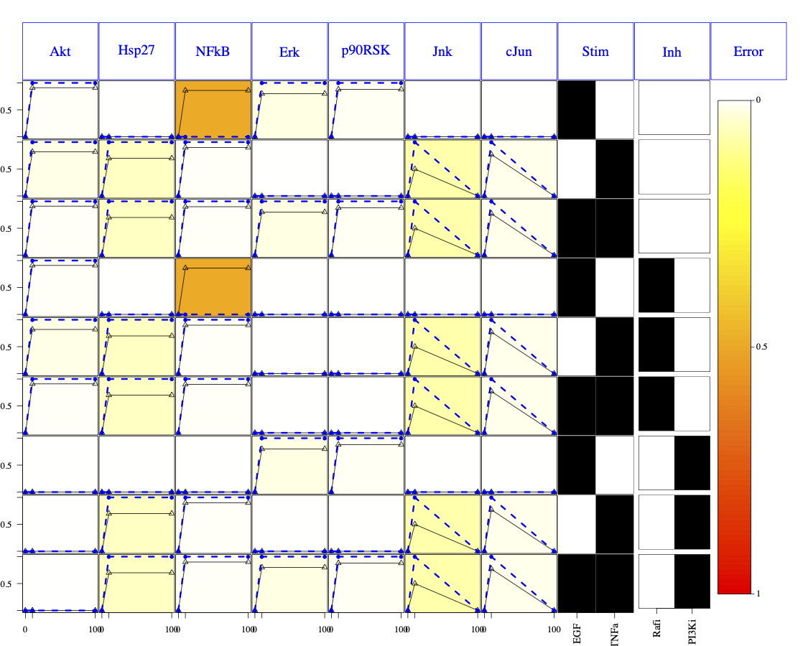
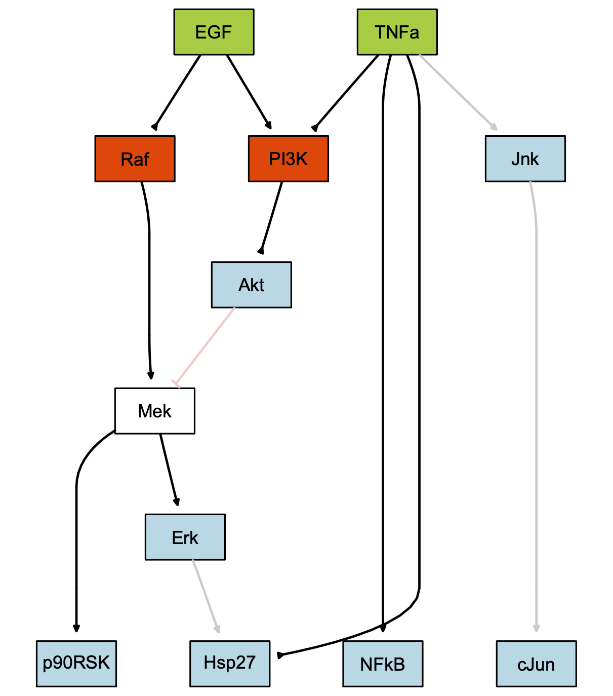
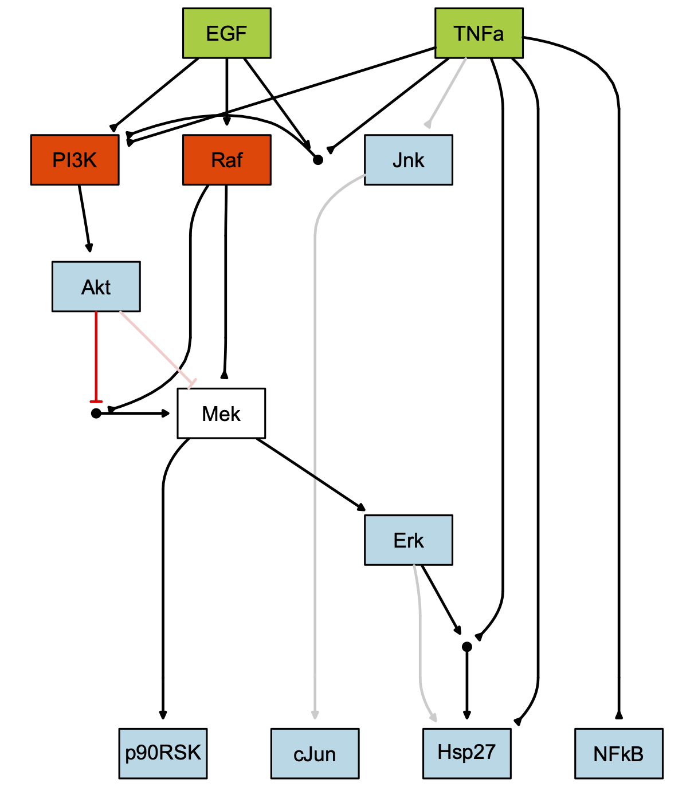
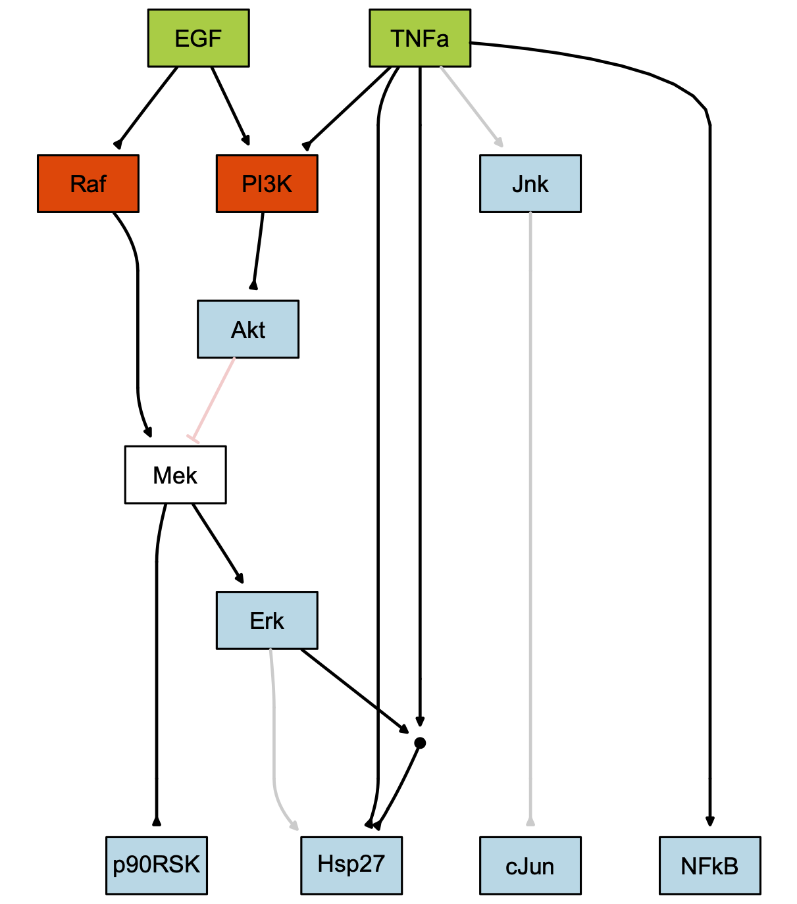
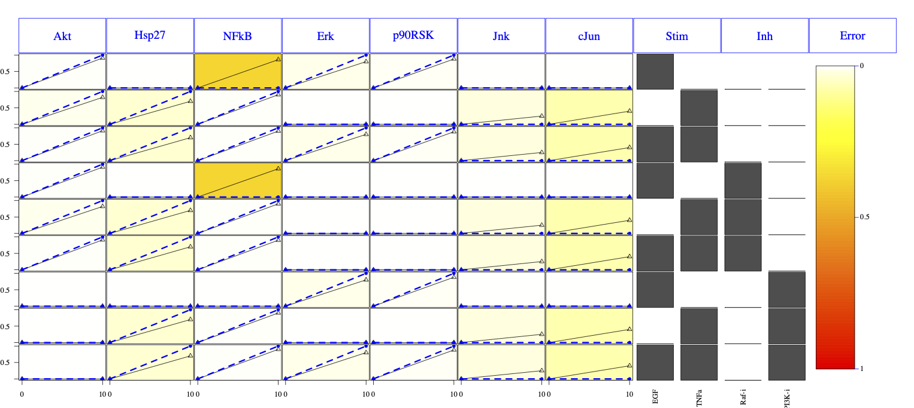

## Installation


Before starting, make sure you have installed the latest version of R (4.1).
For more information and download of R, please refer to (http://www.r-project.org/).   
For more information about how to install R packages, please refer to
(http://cran.r-project.org/doc/manuals/R-admin.html#Installing-packages).

Before starting this tutorial you also need to install the package
*CellNOptR*. You can either install *CellNOptR* from Bioconductor by typing:
```{r installPackage, eval=FALSE}
if (!requireNamespace("BiocManager", quietly=TRUE))
    install.packages("BiocManager")
BiocManager::install("CellNOptR")
```

or from our Github:
```{r installPackage2, eval=FALSE}
if (!requireNamespace("remotes", quietly=TRUE))
	install.packages("remotes")
remotes::install_github("saezlab/CellNOptR")
```


A series of books about R can be found on the R project website
((http://www.r-project.org/)), and many tutorials are available on the
internet. If you are a complete beginner, all you need to know is that by typing
"?nameOfFunction" you get the help page about the function that you are
interested in.

## Introduction

The package *CellNOptR* integrates prior knowledge about protein signalling
networks and perturbation data to infer functional characteristics of a
signalling network. 
CellNOptR performs optimisation using a boolean formalism only@julio2009.
However, it includes some data importing and normalising capabilities (as in 
*DataRail* toolbox @datarail in the MatLab pipeline). Moreover it
is used by other packages that implement more complex formalisms. Such packages
are available on BioConductor as well: CNORdt, CNORode (ordinary
equation-based), CNORProb (probabilisty based logic).
More information about the methods and application of the Matlab pipeline can be
found in reference @CNObc and (http://www.cellnopt.org). 


This tutorial shows how to use *CellNOptR* to analyse 1 or 2 time points
data sets on a toy example (1 time point), a realistic example and another toy
example (with 2 time points).  The whole analysis can also be performed in one
step using a wrapper function as described in section 6.

The first step of an analysis with *CellNOptR* is to load the library, and
create a directory where you can perform your analysis, then set it as your
working directory.

```{r Ropts, include=FALSE}
options(width=70)
```

```{r loadLib, eval=TRUE, message=FALSE, warning=FALSE}
library(CellNOptR)
```

```{r newDir, eval=FALSE}
dir.create("CNOR_analysis")
```

## Quick Start

Assuming that you have a prior knowledge network stored in SIF format and a
MIDAS file, the optimisation of your problem can be done in a couple of steps:

```{r quickstart, eval=FALSE}
# ---------------------- load the library and get a SIF and MIDAS file
library(CellNOptR)

# ---------------------- examples are provided in CellNOptR
data("ToyModel", package="CellNOptR")
data("CNOlistToy", package="CellNOptR")
pknmodel = ToyModel
cnolist = CNOlist(CNOlistToy)

# ---------------------- alternatively you can read your own files:
# pknmodel = readSIF("ToyModel.sif")
# cnolist = CNOlist("ToyDataMMB.csv")

# ---------------------- preprocess the network
model <- preprocessing(cnolist, pknmodel)

# ---------------------- perform the analysis
res <- gaBinaryT1(CNOlist = cnolist,model =  model, verbose=FALSE)

# ---------------------- plot the results
cutAndPlot(cnolist, model, list(res$bString))
```


See the following sections for details.


## Loading the data and prior knowledge network.

Let us first create a directory where to store the file that will be created:

```{r directory, eval=TRUE, include=FALSE}
cpfile <- dir(system.file("ToyModel", package="CellNOptR"), full=TRUE)
file.copy(from=cpfile, to=getwd(), overwrite=TRUE)
```

The example that we use is the toy model example from CellNOpt, which is a data
set and associated network that have been created in silico. This data and
network can be found in the inst/ToyModel directory of this package.  The data
is read using the function *readMIDAS*, which as the name states expects a MIDAS
formatted CSV file (see the documentation of DataRail and @datarail for
more information about that file format). Then, you will need to convert the
data into a *CNOlist*, which is the data structure used in
*CellNOptR*. Please note that this data is already
normalised for boolean modelling. If it had not been the case we would have had
to normalise the data first to scale it between 0 and 1, which can be done using
the  *normaliseCNOlist* function of CellNOptR (see the help of this
function for more information about the normalisation procedure). This
normalisation procedure is the one used in @julio2009 as implemented in
*DataRail*. 


Before version 1.3.30, you would type the following combinaison of commands to create a
CNOlist from a MIDAS file:

```{r getData, eval=TRUE}
dataToy <- readMIDAS("ToyDataMMB.csv", verbose=FALSE)
CNOlistToy <- makeCNOlist(dataToy, subfield=FALSE, verbose=FALSE)
```

Alternatively, this data is provided within *CellNOptR* so you can also
load it as follows

```{r getData2, eval=TRUE}
data(CNOlistToy,package="CellNOptR", verbose=FALSE)
```

However, since version 1.3.30, you can use the *CNOlist* class to load the
data in a single command line

```{r cnolistClass, eval=TRUE, include=FALSE}
CNOlistToy = CNOlist("ToyDataMMB.csv")
```

Note for the users familiar with the previous commands (*readMIDAS* and
and *makeCNOlist*) that you can easily convert the old
data structure into an instance of CNOlist class as follows:

```{r cnolistClass2, eval=FALSE}
data(CNOlistToy,package="CellNOptR")
CNOlistToy = CNOlist(CNOlistToy)
```

A CNOlist is the central data object of this package; it contains
measurements of elements of a prior knowledge network under different
combinations of perturbations of other nodes in the network.  A CNOlist
comprises the following attributes: signals, cues, stimuli,
inhibitors  and timepoints. The attributes cues (and its derivatives stimuli and
inhibitors) are boolean
matrices that contain for each condition (row) a 1 when the corresponding cue
(column) is present, and a zero otherwise.  


You can have a look at your data and the CNOlist format by typing:

```{r showCNO, eval=TRUE}
CNOlistToy
```

You can also visualise your data using the method *plot* (or a function
called *plotCNOlist*) which
will produce a plot on your screen with a subplot for each signal and each
condition, and an image plot for each condition that contains the information
about which cues are present in each condition. This plot can also be produced
and stored in your working directory as a single PDF file using the function
*plotCNOlistPDF*.


```{r plotCNO, fig.width=7, fig.height=7, fig.cap="Figure 1: CNOlist data shown by plotting function (either *plot* or *plotCNOlist*)"}
plot(CNOlistToy)
```


```{r ploCNOPDF, eval=FALSE, include=TRUE}
plotCNOlistPDF(CNOlist=CNOlistToy,filename="ToyModelGraph.pdf")
```

We then load the prior knowledge network (PKN), contained in a Cytoscape SIF format file, using the function *readSIF* (alternatively, this example model can be loaded as a R data object already formatted, similarly to what is done above for the CNOlist).  Cytoscape @Cytoscape is a software for network visualisation and analysis. You can build a network within Cytoscape and simply save it as the default SIF file format, which can then be imported in *CellNOptR*.  If you choose to do this, then you should make sure that if you have 'and' gates in your network they are present as dummy nodes named 'and' followed by a number from 1 to the number of 'and' nodes that you have.

Alternatively, you can create your network file as a text file formatted as a SIF file.  Briefly, the expected file format is a tab delimited text file with a line for each directed interaction and the following three elements per line: name of source node, 1 or -1 if the source node is activating or inhibiting the target node, name of target node.  The names of the species in the model must match some of the nodes in the model (and this is case sensitive).  'And' hyperedges are expected to be represented in the SIF file as dummy nodes named 'and' followed by a number.  For example if you have an interaction of the type 'a \& b=c', your SIF file should contain the following three rows: 'a    1    and1', 'b 1 and1', 'and1 1 c'.  Please be aware that when building the scaffold network for optimisation, the software will create all possible 'and' combinations (with maximum 3 inputs) of edges coming into each node, so in the general case it is not necessary to put 2 or 3 input 'and' hyperedges in the prior knowledge network since the software will create them if the corresponding single edges are present.


```{r getModel, eval=TRUE}
pknmodel<-readSIF("ToyPKNMMB.sif")
```

```{r getModel2, eval=TRUE}
data(ToyModel,package="CellNOptR")
```

Having loaded both the data set and corresponding model, we run a check to make sure that our data and model were correctly loaded and that our data matches our model (i.e. that species that were inhibited/stimulated/measured in our data set are present in our model).

%If this is the case, then we can look for the indices of the species that are present in our dataset in our model, using *indexFinder*. This step will have to be repeated every time an operation is done on the model that removes or reorders species.

```{r indices, eval=TRUE}
checkSignals(CNOlistToy,pknmodel)
```

The SIF model that you have just loaded is visible on figure 2 as
displayed by *plotModel* (requires Rgraphviz to be installed).

```{r plotModel, eval=TRUE, fig.cap="Figure 2: Prior knowledge network (original SIF file visualised by *plotModel*) for the Toy Model example."}
plotModel(pknmodel, CNOlistToy)
```


## Preprocessing the model

Prior to optimisation, the model has to be pre-processed in 3 steps: removal of non-observable/non-controllable species, compression, and expansion.  Each one of these steps is described in more details below.

Since version 0.99.24, a *preprocessing* function is available and makes the
following 3 steps in 1 command line. However, the description of the 3 steps remains
available here below. If you do not bother about details, you can jump directly to section \@ref(sec:preproc).

### Finding and cutting the non observable and non controllable species

Non observable nodes are those that do not have a path to any measured species in the PKN, whereas non controllable nodes are those that do not receive any information from a species that is perturbed in the data.  As we won't be able to conclude anything about these species, we will find them and remove them from the model. Please note that in this particular case there are no nodes to cut, but we still include these steps here because they are necessary in a general case.

```{r NONC, eval=TRUE}
indicesToy<-indexFinder(CNOlistToy,pknmodel,verbose=TRUE)
ToyNCNOindices<-findNONC(pknmodel,indicesToy,verbose=TRUE)
ToyNCNOcut<-cutNONC(pknmodel,ToyNCNOindices)
indicesToyNCNOcut<-indexFinder(CNOlistToy,ToyNCNOcut)
```

### Compressing the model

Compressing the model consists of collapsing paths in which a series of non measured or perturbed nodes input into a measured or perturbed node.  This step is performed because such paths do not bring any additional information compared to their compressed version, and unnecessarily complicate the model.  Typically this includes linear cascades for examples, but this excludes any node that would be:

-  involved in complex logics (more than one input and also more than one output)
-  involved in self loops


Compression is performed using the function *compressModel*.

```{r compress, eval=TRUE}
ToyNCNOcutComp<-compressModel(ToyNCNOcut,indicesToyNCNOcut)
indicesToyNCNOcutComp<-indexFinder(CNOlistToy,ToyNCNOcutComp)
```

### Expanding the gates

The last preprocessing step consists in expanding the gates present in the PKN,
i.e. creating new logic combinations of gates from the ones present in the prior
knowledge network.  This is performed in 2 steps: i) any AND node present in the
PKN is split into its constituent branches, and ii) every time a nodes gets more
than one input, then all 'AND' combinations of the inputs are produced, although
only exploring combinaisons of AND gates with a maximum of 2, 3 or 4 input
nodes (for instance for a 5 inputs case, only $C_2^5$, $C_3^5$, or $C_4^5$
combinations are created). This step is performed because although connections
between nodes might be known or inferred from functional relationships, the
particular logic with which these interactions work or are combined to influence
a target node are generally not known.

This step, performed by the function *expandGates*, will create additional fields *SplitANDs* and *newANDs* in the model that inform you about new edges that have been crated from splitting 'AND' hyperedges, and about new hyperedges that have been created from combinations of edges.

```{r expand, eval=TRUE}
model <- expandGates(ToyNCNOcutComp, maxInputsPerGate=3)
```
Note that here we set the option *maxInputsPerGate* to 3 whereas the
default value is 2.

### Preprocessing function{#sec:preproc}

In *CellNOptR* (from version 1.2), a function called
*preprocessing* gathers the previous three preprocessing steps in a single command
line:

```{r expand2, eval=TRUE}
model <- preprocessing(CNOlistToy, pknmodel, expansion=TRUE,
    compression=TRUE, cutNONC=TRUE, verbose=FALSE)
```
In the previous commands, although the default behaviour of the preprocessing function is to perform the expansion, compression and removing of
non-observable and non-controlable nodes, we set these options to TRUE so as to
emphasize the usage of the function.


## Training of the model

By "optimising the model", we mean exploring the space of possible combinations of expanded gates in the PKN in order to find the combination that reproduces most closely the data.  Comparison between model and data is obtained by  simulating the steady state behaviour of the model under all conditions present in the data, and comparing these binary values to the normalised data points. The match between data and model is quantified using an objective function with parameters *sizeFac* and *NAFac*.  This function is the sum of a term that computes the fit of the simulated data to the experimental data, a term that penalises increased model size (weighted by the parameter *sizeFac*), and a term that penalises NAs in the output of the simulation (i.e. nodes that are in a non resolved state, typically negative feedbacks; weighted by the parameter *NAFac*). Typically this has the following structure: \(\frac{1}{n} \sum_{t,l,k} (M_{t,l,k}-D_{t,l,k})^2 + \alpha \frac{1}{s} \sum_{edges} e_{edges} + \beta n_{NA} \), where n is the number of data points, M the model output for time t, readout l, condition k, D is the corresponding measurement, \(\alpha\) is the size factor, \(e\) is the number of inputs for the egde considered (where \(edges\) are all edges present in the optimised model), s is the number of hyperdeges in the model, \(\beta\) is the NA factor, and \(n_{NA}\) is the number of undetermined values returned by the model.

The optimisation itself is done using a genetic algorithm that tries to optimise a string of 0s and 1s denoting the presence or absence of each gate in the model, where the fitness of each individual string is obtained based on the value of the objective function (score). This genetic algorithm uses the following methods: random initialisation of the population (although an initial string is given to the algorithm in the parameter *initBstring*) of size set by *popSize*, linear ranking based on the scores for fitness assignment (with a default selective pressure of 1.2, set by the parameter *selPress*), stochastic uniform sampling for selection (with an *elitism* parameter that allows the best x strings to be carried on 'as is' to the next generation), uniform crossover probability, and a mutation probability over the sequence set to 0.5 as default (set by *pMutation*).  The search can be stopped using three conditions: a maximum time in seconds (*maxTime*), a maximum number of generations (*maxGens*), and a maximum number of stall generations (i.e. generations where the best string is identical, *stallGenMax*).

The genetic algorithm function returns a list object that collects a number of informations such as the best string and corresponding score at each iteration, the average fit at each generation, etc.  The function also returns strings that were obtained across the whole optimisation process and that obtained scores that were closed to the best string, where 'close' is defined by a relative tolerance on the score which is set by the parameter *relTol*.  This is an important piece of information because when the data cannot constrain the model tightly then many strings are obtained with a fit that is close to the optimal one, and interpretation of edges present in the optimal model is therefore more subtle.

We start off by computing the residual error, which is the minimum error that is
unavoidable with a boolean network and comes from the discrete nature of such a
model (please remember that although the data is normalised in this pipeline, it
is not discretised, and therefore we compare 0/1 values to continuous values
between 0 and 1). This value is important because however good is our
optimisation, the value of the goodness of fit term cannot go under this
residual error. 

```{r resError, eval=TRUE}
resECNOlistToy <- residualError(CNOlistToy)
```


Then, we create an initial bit string for the optimisation,
which in this case is just a string of 1s, but could be a meaningful string if
you have prior expectation about the topology of the model.

```{r initbs, eval=TRUE}
initBstring <- rep(1,length(model$reacID))
```

We can now start the optimisation, in this case with default values for all non essential parameters of the genetic algorithm. If you set the argument verbose to TRUE, this function will print the following information, at each generation: generation number, best score and best string at this generation, stall generation number, average score of this generation and iteration time. You can also find these informations in the object that is returned by this function, as well as the best string the b*bString* field, and strings within the relative tolerance limits in *StringsTol*.


```{r optim, eval=TRUE}
ToyT1opt <- gaBinaryT1(CNOlist=CNOlistToy, model=model,
    initBstring=initBstring, verbose=FALSE)
```

We will now produce plots of our analysis.  First, we plot the results of simulating the data with our best model alongside the actual data set in a plot similar to that obtained above with *plotCNOlist*, except that the simulated data is overlaid in dashed blue lines, and the background of the plot reflects the absolute difference between simulated and experimental data (greener=closer to 0; redder=closer to 1; white=NA, either for data or simulation).  Second, we will plot the evolution of the average score and best score during the evolution of the population of models, as a function of generations.  This is useful to detect problems in the optimisation.


```{r resSim,fig.width=7, fig.height=7, fig.cap="Figure 3: Results of the cutAndPlot function on the Toy Model example."}
cutAndPlot(model=model, bStrings=list(ToyT1opt$bString),
    CNOlist=CNOlistToy,plotPDF=TRUE)
```


```{r plotFit,fig.width=7, fig.height=7, eval=TRUE, fig.cap="Figure 4: Results of the cutAndPlot function on the Toy Model example"}
plotFit(optRes=ToyT1opt)
```


Setting the plotPDF argument to "TRUE" means that a PDF figure will be produced (advised, this will then be linked to your report).  To produce a PDF of the evolution of fit as well (advised), type:


```{r simFitPDF, include=TRUE, eval=FALSE}
cutAndPlot(
    model=model,
    bStrings=list(ToyT1opt$bString),
    CNOlist=CNOlistToy,
    plotPDF=TRUE)
pdf("evolFitToyT1.pdf")
plotFit(optRes=ToyT1opt)
dev.off()
```

Note that for now, you can not set the output filename. It is going to be named
\emph{SimResultsT1\_1.pdf} (if several plots are generated, you get
\emph{SimResultsT1\_2.pdf}
and so on). In the future, users should be able to provide the name. You can
still call *cutAndPlot* without the PDF option and use the R pdf function like in
the example above when calling *plotFit* function.


## Plotting the optimised model

Once you have optimised the processed model the bitstring found correspond to
the best model and you may want to look at the result:

```{r plotModelToy1, eval=T,fig.cap="Figure 4a: Processed model. "}
plotModel(model, CNOlistToy, bString=ToyT1opt$bString)
```


You may also want to look at the correspondence on the original model. To do so,
you will need to map back your best model on top of the PKN. This is done in two
steps:

```{r plotModelToy2, eval=TRUE, fig=F, include=TRUE, fig.cap="Figure 4b: The edges are on (black or red) or off (grey or pink) according to the best set of parameters found during the optimisation (the best bit string). To obtain the right hand side model, the mapBack function has been used."}

bs = mapBack(model, pknmodel, ToyT1opt$bString)
plotModel(pknmodel, CNOlistToy, bs, compressed=model$speciesCompressed)
```


## Writing your results

The next function, *writeScaffold*, allows you to write in a Cytoscape SIF file  the scaffold network that was used for optimisation as well as two corresponding edge attribute files: one that tells you when the edge was called present in the optimised networks (ie 0=absent, 1=present), and one that tells you the weight of each edge as the fraction of models within the relative tolerance distance of the best model's score that actually included the edge. The function also writes the scaffold to a graphviz ((http://www.graphviz.org/Credits.php)) dot file, where the presence/absence is represented by the color of the edge (grey if absent, blue if present) and the weight is represented by the penwidth of the edges.

We then also write the prior knowledge network, using the function *writeNetwork*, which again produces a SIF file and corresponding attributes, and a dot file.  The SIF file has a corresponding edge attribute file that contains the present/absent information mapped back to the PKN, and the node attribute file contains information about the status of the node (compressed, non-observable/non-controllable, signal, inhibited, stimulated).  The dot file encodes the edge information as above and the node information in the color of the node: signals are in blue, inhibited nodes are in red, stimulated nodes are in green, and compressed/cut nodes are in white with dashed contour.   Examples of such files can be found on the following two figures, respectively.

{width=50%}

{width=50%}

You can then write a report that contains relevant information about your
analysis and links to the various plots that you created.  This will be in the
form of an html file called CellNOptReport.html, which will be stored along with
all of your plots in a directory that you create and name (the name of that
folder is a parameter in the function *writeReport*).  Please not that the
function *writeReport* will create the folder and move all of the files
given by the list *namesFiles* into this directory. The files given by the
arguments *dataPlot*, *evolFitT1*, *optimResT1* will then be hyperlinked to your html report.


```{r  eval=FALSE}
writeScaffold(
    modelComprExpanded=model,
    optimResT1=ToyT1opt,
    optimResT2=NA,
    modelOriginal=pknmodel,
    CNOlist=CNOlistToy)

writeNetwork(
    modelOriginal=pknmodel,
    modelComprExpanded=model,
    optimResT1=ToyT1opt,
    optimResT2=NA,
    CNOlist=CNOlistToy)

namesFilesToy<-list(
    dataPlot="ToyModelGraph.pdf",
    evolFitT1="evolFitToyT1.pdf",
    evolFitT2=NA,
    simResultsT1="SimResultsT1_1.pdf",
    simResultsT2=NA,
    scaffold="Scaffold.sif",
    scaffoldDot="Scaffold.dot",
    tscaffold="TimesScaffold.EA",
    wscaffold="weightsScaffold.EA",
    PKN="PKN.sif",
    PKNdot="PKN.dot",
    wPKN="TimesPKN.EA",
    nPKN="nodesPKN.NA")

writeReport(
    modelOriginal=pknmodel,
    modelOpt=model,
    optimResT1=ToyT1opt,
    optimResT2=NA,
    CNOlist=CNOlistToy,
    directory="testToy",
    namesFiles=namesFilesToy,
    namesData=list(CNOlist="Toy",model="ToyModel"))
```

```{r  eval=TRUE, echo=FALSE}
unlink("testToy",recursive=TRUE)
```

## The one step version

If you do not want to bother with all of these steps, there is a function that allows you to do the whole analysis in one step.  In order to do this, you must first load the model and data, as above (assuming that you have already loaded the library and have copied the relevant files in your working directory).

```{r  eval=TRUE}
dataToy <- readMIDAS("ToyDataMMB.csv")
CNOlistToy <- makeCNOlist(dataToy,subfield=FALSE)
pknmodel <- readSIF("ToyPKNMMB.sif")
```

Then you have two possibilities, either you keep all optimisation parameters to their default values and just type

```{r wrap1, eval=FALSE, include=TRUE}
res <- CNORwrap(
    paramsList=NA,
    name="Toy",
    namesData=list(CNOlist="ToyData",model="ToyModel"),
    data=CNOlistToy,
    model=pknmodel)
```

or you want to have some control over the parameters of the optimisation, in which case you create a parameters list with fields *Data* (the CNOlist containing your data),  *model* (your model object),  *sizeFac* (default to 1e-04), *NAFac* (default to 1), *popSize* (default to 50), *pMutation* (default to 0.5), *maxTime* (default to 60), *maxGens* (default to 500), *stallGenMax* (default to 100), *selPress* (default to 1.2), *elitism* (default to 5), *relTol* (default to 0.1), *verbose* (default to FALSE ). You can then call the wrapper function with this set of parameters.

```{r eraseToyDir, eval=TRUE, include=FALSE}
unlink("Toy",recursive=TRUE)
```

```{r wrap2, eval=TRUE}
pList<-defaultParameters(CNOlistToy, pknmodel)
#pList$data = CNOlistToy
#pList$model = ToyModel
res <- CNORwrap(
    paramsList=pList,
    name="Toy1Step",
    namesData=list(CNOlist="ToyData",model="ToyModel"))
```

Both of these versions will generate the graphs produced above on your graphics window, and as PDF's that will be hyperlinked to your html report, and you will be able to find all of these hyperlinked with your html report, all in a directory called by the *Name* parameter, in your working directory.

```{r eraseData, eval=TRUE, echo=FALSE}
unlink("ToyDataMMB.csv")
unlink("ToyPKNMMB.sif")
unlink("Toy1Step",recursive=TRUE)
unlink("ToyModelMMB2.sif")
```

## A real example

This package also contains a slightly larger and more realistic data set, which is a part of the network analysed in @julio2009 and comprises 40 species and 58 interactions in the PKN. This network was also used for the signaling challenge in DREAM 4 (see (http://www.the-dream-project.org/)).  The associated data was collected in hepatocellular carcinoma cell line HepG2 (see @alexopoulos_networks_2010).   The same analysis as above can be performed on this data set.  In order to load this data, you need to copy the files in the "DREAMModel" directory to you working directory (see below) then use *readMIDAS*, *readSIF* and *makeCNOlist*, or load the pre-formatted model and CNOlist objects, as above.

```{r getDREAM, eval=TRUE}
#Option 1: copy the SIF and MIDAS files (followed by readMIDAS, makeCNOlist and readSIF)
cpfile<-dir(system.file("DREAMModel",package="CellNOptR"),full=TRUE)
file.copy(from=cpfile,to=getwd(),overwrite=TRUE)
#Option 2: load the CNOlist and model objects
data(CNOlistDREAM,package="CellNOptR")
data(DreamModel,package="CellNOptR")
```

Having loaded both data and model, you can now visualise your data using
*plotCNOlist* and *plotCNOlistPDF*.  You can now start the
preprocessing of the model, i.e. find the non-observable/non-controllable
species, compress the model, and expand the gates (*preprocessing*).

Having obtained a pre-processed model, we run the training function (*gaBinaryT1*). Finally, we plot the results of our training (*cutAndPlot*, see figure \@ref(fig:DREAMres)) as well as the information about the evolution of fit during optimisation (*plotFit*).


```{r DREAMAnalysis, eval=FALSE}
model = preprocessing(CNOlistDREAM, DreamModel, verbose=FALSE)
res = gaBinaryT1(CNOlistDREAM, model, verbose=FALSE, maxTime=10)
cutAndPlot(CNOlistDREAM, model, bStrings=list(res$bString), plotPDF=TRUE,
    plotParams=list(maxrow=25, margin=0.1, width=20, height=20))


```

{width=60%}


Our analysis is then complete and we can write our results (scaffold network (*writeScaffold*), prior knowledge network (*writeNetwork*) and html report (*writeReport*)). An example of the html report generated for this analysis is shown on figure 8.  

{width=60%}

The scaffold network produced by *writeScaffold* is shown on figure 9.

{width=60%}


## A toy example with two time points

In this section we will demonstrate the use of CellNOptR used when the data comprises two time points where we assume that different mechanisms of regulation are at play, which act on separate time scales.  The data set that we use is the toy model example from CellNOpt, adapted for an optimisation based on two time points (i.e. all signals are kept at the same value as t1 except for cJun and Jnk which go down to zero). The model that we will load is the toymodel from CellNOpt where we added a negative feedback between cJun and Jnk (!cJun=Jnk).  We are going to try and capture this feedback, assuming that this is a slow mechanism that shuts the cJun - Jnk branch down at the second, slower time scale.

In this case the data comprises two time points that we assume are pseudo steady states corresponding to different time scales. The optimisation will therefore be performed in 2 steps, one that finds the reactions present at time 1, and one that finds the reactions that were not present at time 1 and might have entered into play at time 2, explaining the evolution of the signals from time 1 to time 2. First, we load the data and model, and perform the optimisation just as we did for the Toy model above.

```{r t2load, eval=TRUE}
data(CNOlistToy2,package="CellNOptR")
data(ToyModel2,package="CellNOptR")
pknmodel = ToyModel2
cnolist = CNOlist(CNOlistToy2)
```

```{r t2plotCNOlist, fig.width=7, eval=TRUE}
plot(cnolist)
```


```{r t2Opt1, eval=TRUE}
model = preprocessing(cnolist, pknmodel, verbose=FALSE)
T1opt <- gaBinaryT1(cnolist, model, stallGenMax=10, maxTime=60, verbose=FALSE)
```

```{r t2OptT1plot, eval=TRUE, fig.width=7}
sim <- cutAndPlot(model=model, bStrings=list(T1opt$bString),
    CNOlist=cnolist, plotPDF=TRUE)
```


```{r  eval=TRUE, fig.width=6 , fig.height=6}
plotFit(optRes=T1opt)
```

We can now optimise the second time point.

```{r t2OptT2, eval=TRUE}
T2opt<-gaBinaryTN(cnolist, model,  bStrings=list(T1opt$bString),
    stallGenMax=10, maxTime=60, verbose=FALSE)
```

Finally, we produce all the plots and write the report.


```{r resSimT2, eval=FALSE}
res <- cutAndPlot(
    model=model,
    bStrings=list(T1opt$bString, T2opt$bString),
    CNOlist=cnolist,
    plotPDF=TRUE, plotParams=list(cex=0.8, cmap_scale=0.5, margin=0.2))
```

{width=60%}


## A toy example with the ILP implementation

Besides Genetic Algorithm, another approach for training the PKN to data is by using an Integer Linear Programming (ILP) optimization technique. This optimization problem has been implemented based on the formulation from @mitsos_2009. 

In this section we will demonstrate the use of CellNOptR with the ILP implementation with the example provided in the CellNOptR package. For running this feature, users will have to first obtain an *IBM-CPLEX* license (see (https://www.ibm.com/de-de/products/ilog-cplex-optimization-studio)). Onve the *CPLEX* solver is downloaded and installed, then for running CNO-ILP users will have to specify a valid path (*cplexPath*) pointing to the *CPLEX* executable file.

```{r eval=FALSE}
# ---------------------- load the library and get a SIF and MIDAS file
library(CellNOptR)
library(stringr)
#
# ---------------------- examples are provided in CellNOptR
data("ToyModel", package="CellNOptR")
data("CNOlistToy", package="CellNOptR")
pknmodel = ToyModel
cnolist = CNOlist(CNOlistToy)
#
# ---------------------- alternatively you can read your own files:
# pknmodel = readSIF("ToyModel.sif")
# cnolist = CNOlist("ToyDataMMB.csv")
#
# ---------------------- preprocess the network
model = preprocessing(cnolist, pknmodel)
#
# ---------------------- perform the analysis
cplexPath = "path/to/cplex"
resILP = ilpBinaryT1(cnolist = cnolist, model = model, 
                     numSolutions = 3, relGap = 0.05,
                     cplexPath = cplexPath) # asking to retrieve 3 
                                            # equivalent solutions with 
                                            # tolerance gap relGap=0.05
#
# ---------------------- plot the results (optimized models + fits)
cutAndPlot(CNOlist = cnolist, model = model, bStrings = list(resILP$bitstringILP[[1]]))
plotModel(model, cnolist, bString=resILP$bitstringILP[[1]])

cutAndPlot(CNOlist = cnolist, model = model, bStrings = list(resILP$bitstringILP[[2]]))
plotModel(model, cnolist, bString=resILP$bitstringILP[[2]])

cutAndPlot(CNOlist = cnolist, model = model, bStrings = list(resILP$bitstringILP[[3]]))
plotModel(model, cnolist, bString=resILP$bitstringILP[[3]])
```

Figures 11, 12 and 13 show the 3 optimal solutions retrieved by the ILP analysis.

{width=50%}


{width=50%}


{width=50%}


As indicated in Figure 14, the three solutions fit the data with the same quality and the main difference is in the size of network solutions. This example shows how ILP can be used to retrieve alternative sparser solutions which have the same quality of fit and to indicate the most robust interactions or the ones which are consistently present across the solutions.

{width=100%}


Through the gap parameters (relGap) users can control the quality of solutions to retrieve compared to the optimal ones. As a rule of thumb the looser the gap parameters the higher the number of solutions which can be retrieved.

## k-fold Crossvalidation

Cross-validation has been implemented in order to assess the predictive performance of our models and inspect how well these models can predict data outside of its training set. Three re-sampling strategies have been implemented: resampling of 1)data-ponts, 2)experimental conditions and 3)observable nodes. Because of the multiple and possibly extensive analysis, the cross-validation functionality allow for a parallelization of the procedure.

Below we show an example about how we can use the cross-validation functionality by applying different re-sampling strategies in a parallel and serial computing environments.

```{r  eval=FALSE}
# ---------------------- load the library and get a SIF and MIDAS file
library(CellNOptR)
#
# ---------------------- examples are provided in CellNOptR
data(PKN_ToyPB, package="CellNOptR")
data(CNOlist_ToyPB, package="CellNOptR")
#
# ---------------------- preprocess the network
model = preprocessing(data = cnodata,model = pknmodel,compression = T,expansion = T)
plotModel(model,cnodata)
#
#------------------------ original CNOlist contains many timepoints, we use only a subset
plot(cnodata)
selectedTime = c(0,10)
cnodata_prep = cutCNOlist(cnodata ,model = model,
                          cutTimeIndices = which(!cnodata@timepoints %in% selectedTime))
plot(cnodata_prep)
#
# ---------------------- perform the analysis
opt = gaBinaryT1(CNOlist = cnodata_prep,model = model)
#
# ---------------------- 10-fold cross-validation procedure using T1 data
library(doParallel)
doParallel::registerDoParallel(cores=3)
system.time({R1=crossvalidateBoolean(CNOlist = cnodata_prep, model = model, 
                                     type="datapoint", nfolds=10, parallel = TRUE)})
system.time({R2=crossvalidateBoolean(CNOlist = cnodata_prep, model=model, 
                                     type="experiment", nfolds=10, parallel = TRUE)})
system.time({R3=crossvalidateBoolean(CNOlist = cnodata_prep, model=model, 
                                     type="observable", nfolds=10, parallel = TRUE)})
system.time({R4=crossvalidateBoolean(CNOlist = cnodata_prep, model=model, 
                                     type="datapoint", nfolds=10, parallel = FALSE)})
system.time({R5=crossvalidateBoolean(CNOlist = cnodata_prep, model=model, 
                                     type="experiment", nfolds=10, parallel = FALSE)})
system.time({R6=crossvalidateBoolean(CNOlist = cnodata_prep, model=model, 
                                     type="observable", nfolds=10, parallel = FALSE)})
```

## What else
More tutorials can be found in www.cellnopt.org and (http://www.cellnopt.org/)
in particulat on (http://www.cellnopt.org/doc/cnodocs/).

\begin{thebibliography}{1}

\bibitem{alexopoulos_networks_2010}
Alexopoulos, L.G., Saez-Rodriguez, J., Cosgrove, B.D., Lauffenburger, D.A.,
  Sorger, P.K.: Networks inferred from biochemical data reveal profound
  differences in toll-like receptor and inflammatory signaling between normal
  and transformed hepatocytes.
\newblock Molecular \& Cellular Proteomics: {MCP} **9**(9), 1849--1865
  (2010).

  \bibitem{CNObc}
M.K.~Morris, I.~Melas, J.~Saez-Rodriguez.
\newblock Construction of cell type-specific logic models of signalling networks using CellNetOptimizer.
\newblock {\em Methods in Molecular Biology: Computational Toxicology}, Ed. B. Reisfeld and A. Mayeno, Humana Press.

\bibitem{datarail}
J.~Saez-Rodriguez, A.~Goldsipe, J.~Muhlich, L.G.~Alexopoulos, B.~Millard, D.A.~Lauffenburger and P.K.~Sorger.
\newblock Flexible informatics for linking experimental data to mathematical models via *DataRail*.
\newblock {\em Bioinformatics}, 24:6, 2008.

\bibitem{julio2009}
J.~Saez-Rodriguez, L.~Alexopoulos, J.~Epperlein, R.~Samaga, D.~Lauffenburger, S.~Klamt and P.K.~Sorger.
\newblock Discrete logic modelling as a means to link protein signalling networks with functional analysis of mammalian signal transduction.
\newblock {\em Molecular Systems Biology}, 5:331, 2009.

\bibitem{Cytoscape}
P.~Shannon, A.~Markiel, O.~Ozier, N.S..~Baliga, J.T.~Wang, D.~Ramage,  N.~Amin, B.~Schiwkowski and T.~Ideker.
\newblock Cytoscape: a software for integrated models of biomolecular interaction networks.
\newblock {\em Genome Research}, 13(11):2498-504, 2003.

\bibitem{mitsos_2009}
Mitsos, A., Melas, I.N., Siminelakis, P., Chairakaki, A.D.,
  Saez-Rodriguez, J.: Identifying Drug Effects via Pathway Alterations using an Integer Linear Programming Optimization Formulation on Phosphoproteomic Data.
\newblock PLOS \& Computational Biology **5**(12): e1000591
  (2010).


\end{thebibliography}
